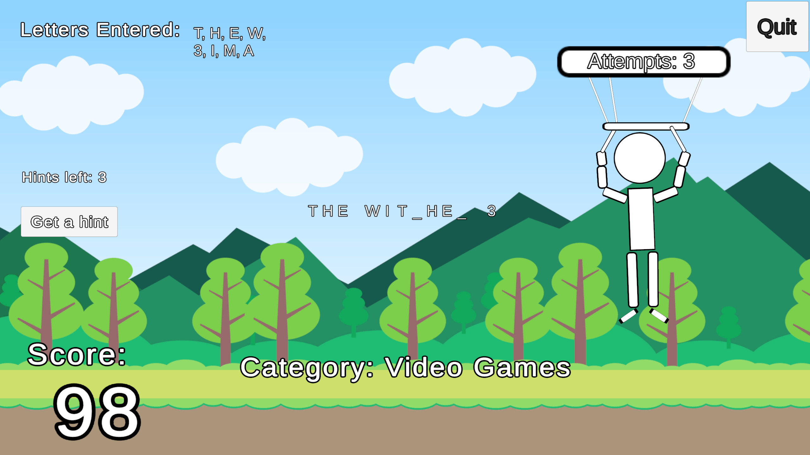

# Hangman Infinity
A hangman game developed in the Unity Engine. 

This game was created as a university project, and was made open source after completion.

## Download link can be found here:
https://drive.google.com/file/d/15DX4W1IaZZqqrNSHu8kVkd9kG3h9Ypoo/view?usp=sharing

## In-game preview

## Credits
Created by [**Brodie Berger**](https://github.com/brodieberger), and [**Joussef Ibarra**](https://github.com/Ngpv24)

[CPasteGame for the Cartoon Background assets](https://assetstore.unity.com/packages/2d/environments/free-2d-cartoon-parallax-background-205812)
[CarterGames for the Leaderboard Manager assets](https://github.com/CarterGames/LeaderboardManager)